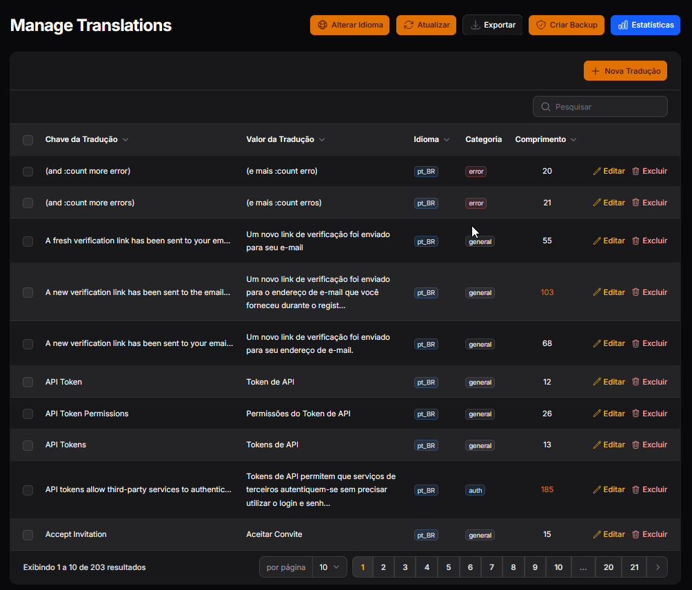

# Filament Smart Translation

[](https://github.com/rodrigofs/filament-smart-translate/actions/workflows/run-tests.yml)
[](https://github.com/rodrigofs/filament-smart-translate/actions/workflows/phpstan.yml)
[](https://github.com/rodrigofs/filament-smart-translate/actions/workflows/fix-code-style.yml)


**Complete translation solution for Filament v4** that provides automatic translation for all components with zero configuration, plus a powerful translation management interface for development.

## ✨ Features

- **🎯 Zero Configuration**: Form fields, columns, actions work instantly
- **🔧 Simple Traits**: Resources, Pages, Clusters need one line of code
- **🎛️ Smart Fallbacks**: Intelligent fallback strategies when translations are missing
- **📱 Translation Manager**: Built-in interface to manage translations (development mode)
- **🌐 Multi-locale Support**: Full Laravel translation system support
- **📊 Status Dashboard**: Visual overview of implementation status
- **⚡ High Performance**: Optimized with caching and lazy evaluation

## 📦 Installation

### 1. Install Package

```bash
composer require rodrigofs/filament-smart-translate
```

### 2. Publish Configuration (Optional)

```bash
php artisan vendor:publish --tag=filament-smart-translate-config
```

### 3. Check Status

```bash
php artisan filament-smart-translate:status
```

## 🚀 Quick Start

### 1. Set Your Locale

```php
// config/app.php
'locale' => 'pt_BR', // or your preferred locale
```

### 2. Create Translation Files

```json
// lang/pt_BR.json
{
    "name": "Nome",
    "email": "E-mail",
    "user": "Usuário",
    "admin": "Administração",
    "create": "Criar",
    "edit": "Editar",
    "delete": "Excluir"
}
```

### 3. Add Traits to Resources, Pages & Clusters

**Only for Resources, Pages, and Clusters** - other components work automatically:

```php
// Resources

use Rodrigofs\FilamentSmartTranslate\Traits\Resource\ResourceTranslateble;

class UserResource extends Resource
{
    use ResourceTranslateble; // ⭐ Add this line
}

// Pages
use Rodrigofs\FilamentSmartTranslate\Traits\Page\PageTranslateble;

class Settings extends Page
{
    use PageTranslateble; // ⭐ Add this line
}

// Clusters
use Rodrigofs\FilamentSmartTranslate\Traits\Cluster\ClusterTranslateble;

class UserManagement extends Cluster
{
    use ClusterTranslateble; // ⭐ Add this line
}
```

**That's it!** Your Filament interface will now display translated labels automatically.

## 🎯 How It Works

### ✅ Automatic (No Code Changes)
These components work instantly with **zero configuration**:

- **Form Fields**: TextInput, Select, Checkbox, etc.
- **Table Columns**: TextColumn, BooleanColumn, etc.
- **Actions**: CreateAction, EditAction, DeleteAction, etc.
- **Layout**: Section, Tabs, Group, etc.

### 🔧 Trait Required
These components need **one trait per class**:

- **Resources**: Model labels & navigation → `ResourceTranslateble`
- **Pages**: Navigation groups → `PageTranslateble`
- **Clusters**: Breadcrumbs & navigation → `ClusterTranslateble`

| Component | Automatic | Trait Required |
|-----------|-----------|----------------|
| Form Fields | ✅ Yes | ❌ No |
| Table Columns | ✅ Yes | ❌ No |
| Actions | ✅ Yes | ❌ No |
| Layout | ✅ Yes | ❌ No |
| **Resources** | ❌ No | ✅ Yes |
| **Pages** | ❌ No | ✅ Yes |
| **Clusters** | ❌ No | ✅ Yes |

## 📱 Translation Manager (Development Feature)

The package includes a **powerful translation management interface** for development environments.

### ⚠️ Important: Development Only

**The Translation Manager should only be used in development environments** to avoid Git conflicts during production deployments.

**The Problem**: The manager modifies JSON translation files directly. When you pull updates from Git to your production server, these local changes will conflict with incoming changes, potentially causing deployment failures or requiring manual conflict resolution during `git pull` operations.

use Filament\Pages\Page;use Rodrigofs\FilamentSmartTranslate\Traits\Page\PageTranslateble;

### 🔧 Enable Translation Manager

#### 1. Register the Plugin

Add the TranslationPlugin to your Filament panel:

```php
// app/Providers/Filament/AdminPanelProvider.php
use Rodrigofs\FilamentSmartTranslate\TranslationPlugin;

public function panel(Panel $panel): Panel
{
    return $panel
        // ... other configurations
        ->plugins([
            TranslationPlugin::make(), // ⭐ Add this line
            // ... other plugins
        ]);
}
```

#### 2. Configure the Translation Manager

Add to your configuration:

```php
// config/filament-smart-translate.php
'translation_page' => [
    'enabled' => true,
    'dev_only' => true, // ⭐ Important: Only in development
    'navigation' => [
        'enabled' => true,
        'group' => 'Development',
        'sort' => 99,
        'icon' => 'heroicon-o-language',
    ],
    'page' => [
        'title' => 'Translation Manager',
        'navigation_label' => 'Translations',
    ],
    'features' => [
        'export' => true,
        'backup' => true,
        'language_selector' => true,
        'bulk_actions' => true,
    ],
    'authorize' => env('APP_DEBUG', false), // Only when debug is enabled
],
```

### 📸 Translation Manager Features



*Translation Manager interface showing the translation editing capabilities*

**🌐 Multi-language Interface**
- Switch between locales instantly
- Add, edit, delete translations
- Bulk operations for efficiency

**📊 Statistics Dashboard**
- Total translations count
- Empty translations detection
- Progress tracking per locale

**💾 Backup & Export**
- Automatic backups before changes
- Export translations to JSON
- Safe file handling

**🔍 Search Functionality**
- Search translations by key or value

### 🛡️ Production Alternative

If you **must** use the Translation Manager in production:

1. **Remove translation files from Git tracking**:
```bash
# Add to .gitignore
lang/*.json
!lang/en.json  # Keep English as template
```

2. **Configure for production**:
```php
'translation_page' => [
    'enabled' => env('TRANSLATION_MANAGER_ENABLED', false),
    'dev_only' => false,
    'authorize' => function () {
        return auth()->user()?->hasRole('admin');
    },
],
```

3. **Use environment variable**:
```env
# Only enable when needed
TRANSLATION_MANAGER_ENABLED=true
```

⚠️ **Recommendation**: Keep the Translation Manager in development only to avoid Git conflicts during production deployments (`git pull` operations).

## 🎛️ Fallback Strategies

When translations are missing, the package applies intelligent fallback strategies:

### Built-in Strategies

#### 1. `original` (Default)
Keeps the original key format:
```
user_name → User name
email_address → Email address
```

#### 2. `humanize`
Converts to human-readable format:
```
user_name → User Name
emailAddress → Email Address
```

#### 3. `lower_case`
Converts to lowercase with hyphens:
```
user_name → user-name
email_address → email-address
```

### Component-Specific Configuration

```php
'components' => [
    'fields' => [
        'enabled' => true,
        'fallback_strategy' => 'original'
    ],
    'resources' => [
        'enabled' => true,
        'fallback_strategy' => 'humanize'
    ],
    'actions' => [
        'enabled' => true,
        'fallback_strategy' => 'lower_case'
    ]
]
```

### Custom Strategies

Create your own fallback strategy:

```php
<?php

namespace App\Strategies;

use Rodrigofs\FilamentSmartTranslate\Support\Fallback\FallbackStrategyInterface;

class UppercaseStrategy implements FallbackStrategyInterface
{
    public function apply(string $key): string
    {
        return strtoupper(str_replace('_', ' ', $key));
    }
}
```

Register in configuration:
```php
'fallback_strategies' => [
    'uppercase' => \App\Strategies\UppercaseStrategy::class,
],
```

## 🌍 Translation Structure

### Recommended: Component-Prefixed Keys
```json
{
    "resources.user": "Usuário",
    "navigations.admin": "Administração",
    "actions.create": "Criar",
    "fields.name": "Nome"
}
```

### Alternative: Direct Keys
```json
{
    "name": "Nome",
    "email": "E-mail",
    "user": "Usuário"
}
```

### Resolution Order
1. Component-prefixed key (`resources.user`)
2. Direct key (`user`)
3. Fallback strategy result

## 📊 Status Command

Get a complete overview of your setup:

```bash
php artisan filament-smart-translate:status
```

**Shows:**
- ✅ Package status (enabled/disabled)
- 🎯 Trait usage (Resources, Pages, Clusters)
- ⚠️ Missing trait candidates
- 🔧 Component coverage with strategies
- 📊 Overall statistics and tips

**Example output:**
```
  ╔══════════════════════════════════════════════════════════╗
  ║  Filament Smart Translation - Status Report              ║
  ╚══════════════════════════════════════════════════════════╝

  📦 Package Status: ✓ ENABLED

  🎯 Trait Usage:
    ✓ ResourceTranslateble (2 files)
    ⚠ Files that could use traits: 3 candidates

  🔧 Component Coverage:
    ✓ Resources (humanize)
    ✓ Fields (original)
    ✓ Actions (lower_case)

  📊 Coverage Summary: 9/9 components active (100%)
```

## 💡 Complete Example

### Resource with Translation Trait

```php
<?php

namespace App\Filament\Resources;

use App\Models\User;
use Filament\Forms;
use Filament\Resources\Resource;
use Filament\Tables;
use Rodrigofs\FilamentSmartTranslate\Traits\Resource\ResourceTranslateble;

class UserResource extends Resource
{
    use ResourceTranslateble; // ⭐ Add this for model labels

    protected static ?string $model = User::class;
    protected static ?string $navigationGroup = 'user_management';

    public static function form(Form $form): Form
    {
        return $form->schema([
            // These translate automatically (no code changes needed)
            Forms\Components\TextInput::make('name'),
            Forms\Components\TextInput::make('email'),
            Forms\Components\Select::make('role'),

            Forms\Components\Section::make('profile') // Section titles too!
                ->schema([
                    Forms\Components\TextInput::make('first_name'),
                    Forms\Components\TextInput::make('last_name'),
                ]),
        ]);
    }

    public static function table(Table $table): Table
    {
        return $table
            ->columns([
                // Column headers automatically translated
                Tables\Columns\TextColumn::make('name'),
                Tables\Columns\TextColumn::make('email'),
                Tables\Columns\TextColumn::make('role'),
            ])
            ->actions([
                // Action labels automatically translated
                Tables\Actions\EditAction::make(),
                Tables\Actions\DeleteAction::make(),
            ]);
    }
}
```

### Translation File

```json
// lang/pt_BR.json
{
    "name": "Nome",
    "email": "E-mail",
    "role": "Função",
    "first_name": "Primeiro Nome",
    "last_name": "Último Nome",
    "profile": "Perfil",
    "resources.user": "Usuário",
    "navigations.user_management": "Gerenciamento de Usuários",
    "actions.edit": "Editar",
    "actions.delete": "Excluir"
}
```

**Result**: Complete Portuguese interface with intelligent fallbacks!

## 🔧 Configuration

Full configuration options:

```php
<?php
// config/filament-smart-translate.php

return [
    // Global enable/disable
    'enabled' => env('FILAMENT_SMART_TRANSLATE_ENABLED', true),

    // Translation Manager (Development Feature)
    'translation_page' => [
        'enabled' => false, // Enable translation management interface
        'dev_only' => true, // ⚠️ Important: Only in development
        'navigation' => [
            'enabled' => true,
            'group' => 'Development',
            'sort' => 99,
            'icon' => 'heroicon-o-language',
        ],
        'page' => [
            'title' => 'Translation Manager',
            'navigation_label' => 'Translations',
        ],
        'features' => [
            'export' => true,
            'backup' => true,
            'language_selector' => true,
            'bulk_actions' => true,
        ],
        'authorize' => env('APP_DEBUG', false),
    ],

    // Component-specific settings
    'components' => [
        'resources' => [
            'enabled' => true,
            'fallback_strategy' => 'original'
        ],
        'fields' => [
            'enabled' => true,
            'fallback_strategy' => 'original'
        ],
        'actions' => [
            'enabled' => true,
            'fallback_strategy' => 'original'
        ],
        // ... other components
    ],

    // Custom fallback strategies
    'fallback_strategies' => [
        // 'custom' => \App\Strategies\CustomStrategy::class,
    ],

    // Debug settings
    'debug' => [
        'log_missing_translations' => env('FILAMENT_SMART_TRANSLATE_DEBUG', false),
    ],
];
```

## 🔧 Troubleshooting

### Translations Not Showing?

1. **Check locale**: Verify `config/app.php` locale setting
2. **Clear cache**: Run `php artisan config:clear`
3. **Add traits**: Resources/Pages/Clusters need traits
4. **Check files**: Ensure translation files exist
5. **Run status**: Use `php artisan filament-smart-translate:status`

### Resources/Pages/Clusters Not Translating?

Add the required traits:

```php

// Resource
use ResourceTranslateble;

// Page
use PageTranslateble;

// Cluster
use ClusterTranslateble;

```

### Translation Manager Not Working?

1. **Register the plugin**: Add `TranslationPlugin::make()` to your Filament panel
2. **Enable in config**: Set `translation_page.enabled => true`
3. **Check authorization**: Verify `authorize` callback
4. **Development mode**: Ensure you're in development environment
5. **Clear cache**: Run `php artisan config:clear`

### Git Conflicts During Production Deployment?

**The Issue**: Translation Manager changes create local modifications that conflict with `git pull` during production updates.

**Recommended Solution**: Use Translation Manager only in development.

**Alternative for Production Use**: Remove translation files from Git tracking:
```bash
echo "lang/*.json" >> .gitignore
git rm --cached lang/*.json
```

## 📖 Requirements

- **PHP**: 8.2+
- **Laravel**: 11+
- **Filament**: 4.0+

## 🤝 Contributing

1. Fork the repository
2. Create your feature branch
3. Run tests: `composer test`
4. Submit a pull request

## 📝 License

MIT License - see [LICENSE](LICENSE) file.

## 🙏 Acknowledgements

- **Filament Team**: For the amazing admin framework
- **Laravel Team**: For the solid foundation
- **Community**: For feedback and contributions

---

**Made with ❤️ for the Filament community**

[](https://github.com/rodrigofs/filament-smart-translate)
